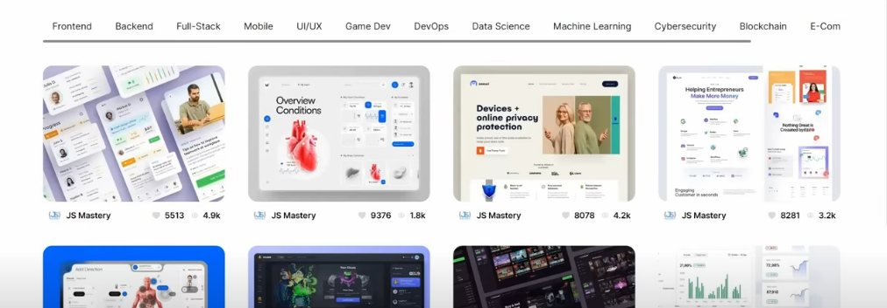

   
    
   

  

    
    
    
    
    
    
     
  

  <h3 align="center">Flex - A Full Stack Dribble Clone</h3>

## <a name="introduction">🤖 Introduction</a>

**Flex** is a full stack Dribble clone developed using Next.js, GraphQL, Next Auth, TypeScript, and Tailwind CSS. It features all the necessary functionality of Dribble, including the ability to share and showcase projects.

If you're getting started or encounter any issues, feel free to reach out to the community for support.

## <a name="tech-stack">⚙️ Tech Stack</a>

- **Next.js**: For building fast and dynamic web applications.
- **Next Auth**: Provides authentication for secure user login.
- **TypeScript**: Ensures type safety for building scalable and maintainable applications.
- **JSON Web Token (JWT)**: Used for secure user authentication.
- **GraphQL**: A query language for APIs to fetch and manipulate data efficiently.
- **Cloudinary**: For handling image storage and management in the cloud.
- **Tailwind CSS**: A utility-first CSS framework for custom styling.
- **Headless UI**: A set of completely unstyled, fully accessible UI components.

## <a name="features">🔋 Features</a>

👉 **Modern Design Home Page**: A sleek and modern homepage with an intuitive layout, showcasing project previews and easy navigation.

👉 **Browsing and Pagination**: Browse and filter various projects seamlessly, with smooth pagination to explore data effortlessly.

👉 **Authentication & Authorization System**: A secure login system that includes JWT and Google authentication for users.

👉 **Create Post Page**: A dedicated space for users to submit their projects. The form supports project details, image uploads, and additional media.

👉 **Project Details and Related Projects**: A detailed view of each project, with recommendations for similar projects based on category or theme.

👉 **Edit and Re-upload Images**: Users can modify previously submitted projects and update images by uploading them directly to the cloud.

👉 **Delete Projects**: An easy-to-use delete feature to remove projects with a single click.

👉 **Portfolio-Style User Profile Page**: Each user has a portfolio-style profile page to display their projects and explore others’ portfolios.

👉 **Backend API Routes**: Includes backend routes for JWT token management, secure authentication, and image uploads, allowing seamless integration between frontend and backend.

Additionally, the app offers reusable components, efficient architecture, and other advanced features for a complete and smooth user experience.

---

**Flex** is designed to help users share, discover, and showcase their creative projects with ease, using cutting-edge technologies to deliver a fast and reliable user experience.
